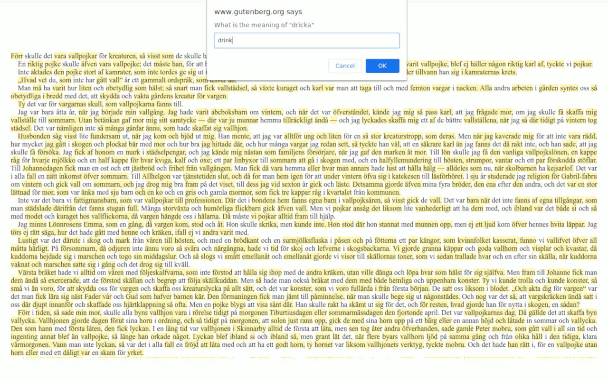
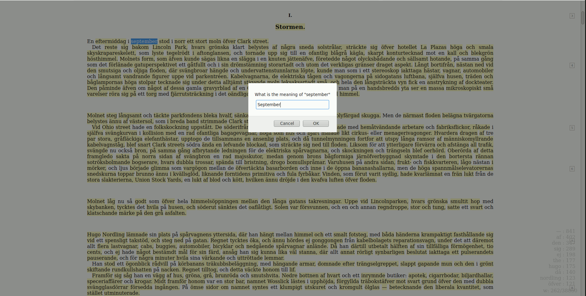
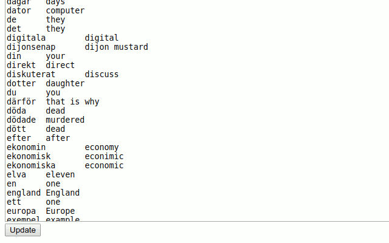
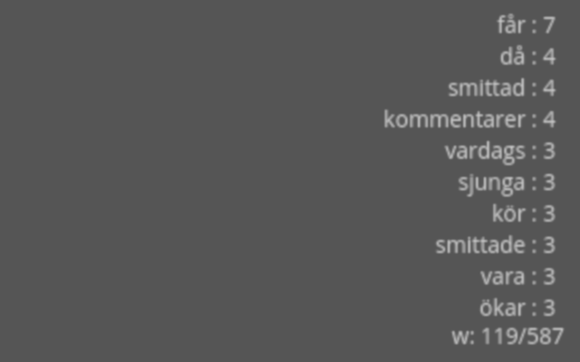

# Flash Cardon

## Description

Turn any web page to a learning experience.
The extension allows you to build vocabulary by keeping track of known words, and highlighting the new ones to learn.
The whole collected vocabulary can be exported as structured text and used to create flash cards.

## How to use

- Open a web page in the language you want to learn
- Click on the Flash Cardon icon on the top of the browser. All words which are not added will get an yellow highlight background.
- Double click on a word to add or update it's meaning.
- You can also see some statistics in the lower right corner of the page

Export/Import/Update Vocabulary
- Right click on the Flash Cardon icon and select Manage Words from the popup menu.

## Installation

* [Chrome web store](https://chrome.google.com/webstore/detail/flash-cardon/kljjkndkgodhkabbkecjlladgmeapiaf)
* [Firefox Addons](https://addons.mozilla.org/en-GB/firefox/addon/flash-cardon/)

## Changelog:

1.0.1
- added word review page (only randomized list at the moment)

1.0.0
- added created and updated fields for each word
- import from both old and new backups
- database migration on install

0.0.4
- added download button on the manage words page

## Screenshots

### Page in action

### Export/import vocabulary

## Statistics
