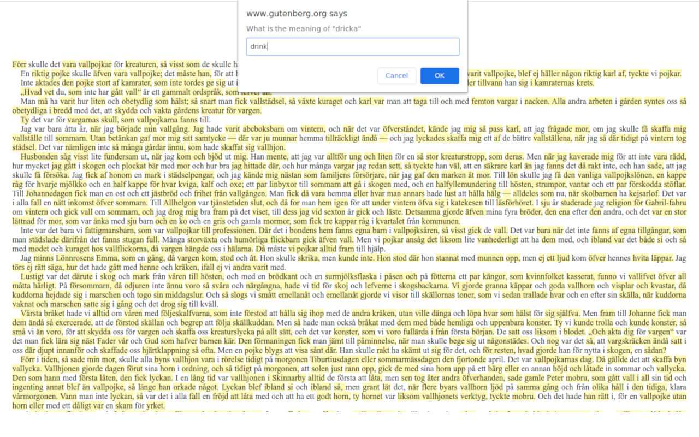

# Flash Cardon

Flash Cardon is a browser extension which turns any web page to a learning experience. The extension allows you to build vocabulary by keeping track of known words, and highlighting the new ones. The whole collected vocabulary can be exported as structured text.

## Page in action

## Export/import vocabulary

